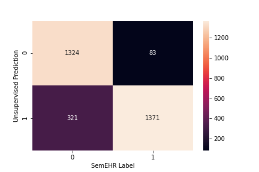

# Un/supervised BERT NER training on medical data

Natural Language Experiments comparing unsupervised and supervised BERT training approaches.

## Problem Statement

High recall lexicon has been run on medical case notes. Need a deep learning
model over the top to distinguish between false and true positives NER hits. 
Gold labels do exist though.

## Approach

Investigate if just through unsupervised training (masked language modelling)
the representations from the last hidden layer of a BERT model would be enough to 
classify through k-means clustering.

Supervised model also trained for performance comparison. However, in 'real world'
applications unlikely to have gold label data hence motivation for unsupervised approach

## Results

Unsupervised works!! This is a PCA visualisation of the hidden dimensions. The marker colours show the classes of the inputs and the red crosses the k-means centroids. 

And gives fairly good performance 

Although as is the norm (if the data is available) supervised learning will outperform

A more thorough report of methodology and results is presented in `report.pdf`

## To run

### Training

All training code is contained within main.ipynb but with the training call commented out. 
Unfortunately, access to the data is not mine to give if of interest please get in touch and I 
can forward your request on.

### Inference

`pip install -r requirements.txt`

The best trained models are publicly available.

Download and place in `models` folder

Run the notebook. Simple as that!

## Improvements

Code is clunky and far from optimised (a lot of for loops instead of tensor operations).
But as this was a proof of concept on relatively small amounts of data, efficiency was a 
secondary concern.

Training is stopped at 4 epochs. Could be converted for use on a cluster for larger training
but performance already enough to show pros and cons of the 2 approaches

Could use huggingFace's trainer

